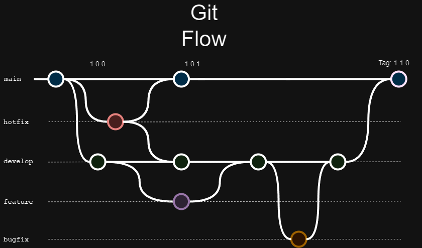

# Guía de Trabajo con Ramas en el Repositorio

## Estructura de Ramas

### Rama `main`
- La rama `main` contiene el código en producción.
- Solo se fusionan aquí los cambios aprobados y testeados.
- Está protegida contra commits directos y requiere revisiones de código para la fusión.

### Rama `development`
- Es la rama base para la integración de nuevas características.
- Está protegida contra commits directos y requiere revisiones de código para la fusión (al menos un miembro del equipo debe revisar y aprobar el código).
- Todo el desarrollo debe realizarse en ramas de características o correcciones que se crean a partir de `development`.

### Ramas de Características (`feature`)
- Se utilizan para desarrollar nuevas funcionalidades.
- Deben crearse a partir de la rama `development`.
- Nomenclatura: `feature/nombre-descriptivo`.
- Una vez completadas, se debe crear un Pull Request (PR) para fusionar en `development`.

### Ramas de Corrección (`bugfix`)
- Se utilizan para corregir errores detectados en `development`.
- Deben crearse a partir de la rama `development`.
- Nomenclatura: `bugfix/descripcion-del-bug`.
- Una vez solucionado el bug, se debe crear un PR para fusionar en `development`.

### Ramas de Hotfix (`hotfix`)
- Se utilizan para solucionar problemas críticos en producción.
- Deben crearse a partir de la rama `main`.
- Nomenclatura: `hotfix/descripcion-del-hotfix`.
- Una vez solucionado el problema, se debe crear un PR para fusionar tanto en `main` como en `development`.

## Flujo de Trabajo

### Crear una Nueva Rama de Funcionalidad:
Antes de comenzar a trabajar en una nueva tarea o funcionalidad, crea una nueva rama a partir de `development`.

### Trabajar en la Nueva Funcionalidad:
Realiza tus cambios y realiza commits regularmente.

### Subir la Rama al Repositorio Remoto:
Sube tu rama de funcionalidad al repositorio remoto para que otros puedan verla.

### Crear un Pull Request:
Cuando hayas terminado tu trabajo en la rama de funcionalidad, crea un Pull Request (PR) para fusionar tus cambios en `development`.

### Revisión de Código:
Al crear el PR, al menos un miembro del equipo debe revisar tu código.

### Fusionar el Pull Request:
Una vez que tu PR ha sido aprobado, el administrador fusionará el PR en la rama `development`. **NO SE DEBE HACER MERGE DIRECTO A `main`.**

### Mantener la Rama `development` Actualizada:
Es importante mantener tu rama `development` actualizada con los últimos cambios de `main`.

### Eliminar la Rama de Funcionalidad:
Después de fusionar tu PR, elimina la rama de funcionalidad localmente y en el remoto.

## Buenas Prácticas:

- Realiza commits pequeños y frecuentes.
- Escribe mensajes de commit claros y descriptivos.
- Mantén tu rama de funcionalidad enfocada en una tarea específica.
- Sincroniza frecuentemente con la rama `development` para evitar conflictos grandes.
- Realiza todas las pruebas necesarias para asegurarte de que los cambios no introducen nuevos errores.
